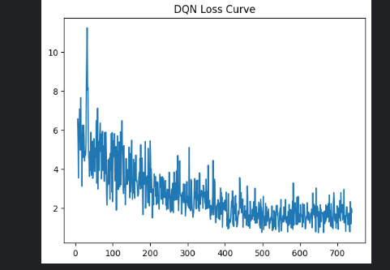
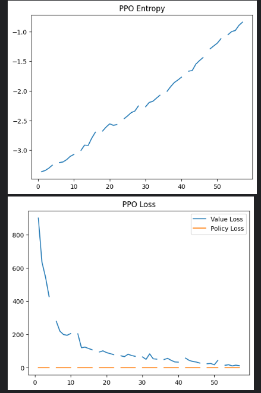
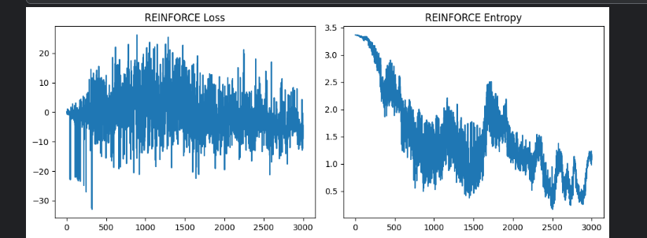
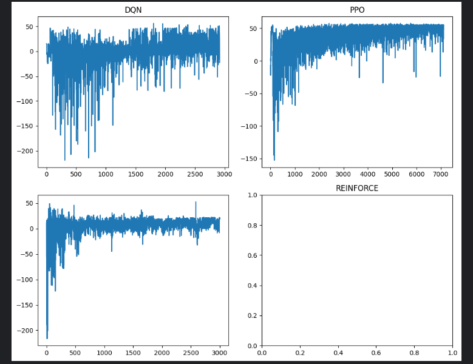
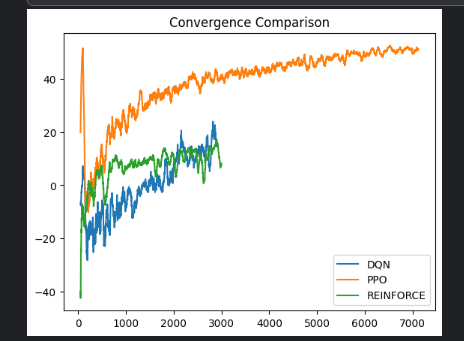
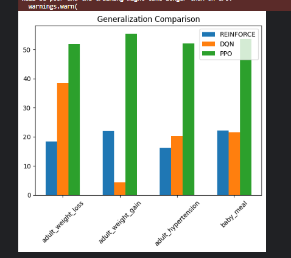

# Kitchen Meal Planning RL Project

## Project Overview

This project explores the use of **Reinforcement Learning (RL)** for automated meal planning in a simulated kitchen environment. The goal is to optimize meal plans for different scenarios such as adult weight loss, weight gain, hypertension management, and baby meals. Three RL algorithms were implemented and compared:

* **DQN (Deep Q-Network)**
* **REINFORCE (Policy Gradient)**
* **PPO (Proximal Policy Optimization)**

The project evaluates training performance, convergence, stability, and generalization of each method across multiple scenarios.

## Project Structure

```
KitchenMealPlanningRL/
│
├─ environment/
│   └─ custom_env.py          # Custom Gym-like meal planning environment
│   └─ rendering.py
├─ training/
│   ├─ dqn_training.py        # DQN training and evaluation
│   ├─ reinforce_training.py  # REINFORCE training and evaluation
│   ├─ ppo_training.py        # PPO training and evaluation
│
├─ logs/
│   ├─ dqn/
│   ├─ reinforce/
│   └─ ppo/
│       └─ monitor.csv, progress.csv, eval.csv
│
├─ best_models/
│   ├─ dqn/
│   ├─ reinforce/
│   └─ ppo/
│
├─ results/
│   └─ demo visualisations/               
│─ notebooks/
│─ screenshots/ # store pygame screenshots 
├─ app.py       # Streamlit demo interface
├─capture_all_model_screenshot_pygame.py
└─ README.md
```

## How to Set Up

1. Clone the repository:

```bash
git clone <repo_url>
cd meal_planning_rl
```

2. Create a Python virtual environment:

```bash
python -m venv venv
source venv/bin/activate  # Linux/Mac
venv\Scripts\activate     # Windows
```

3. Install required packages:

```bash
pip install -r requirements.txt
```

*Requirements include:* `torch`, `numpy`, `pandas`, `matplotlib`, `pygame`, `gym`, `streamlit`

## How to Run Training

### DQN

```bash
python training/dqn_training.py
```

### REINFORCE

```bash
python training/reinforce_training.py
```

### PPO

```bash
python training/ppo_training.py
```

* Trained models are automatically saved in `best_models/`.
* Training logs are saved in `logs/` for visualization.

## pygame visualisation

To take and save pygame visualisation screenshots
```bash
python capture_all_model_screenshot_pygame.py --capture-every-step
```

## Streamlit Demo

A simple interface allows you to test trained policies interactively:

```bash
streamlit run app.py
```

Features:

* Select scenario: `adult_weight_loss`, `adult_weight_gain`, `adult_hypertension`, `baby_meal`
* Choose trained RL agent: `DQN`, `REINFORCE`, `PPO`
* Step through episodes and view rewards


## Hyperparameters

### DQN

| Learning Rate | Gamma | Replay Buffer | Batch Size | Exploration | Overall Mean Reward | Adult weight loss | Adult weight gain | Hypertension | Baby Meal |
| ------------- | ----- | ------------- | ---------- | ----------- | ------------------- | ----------------- | ----------------- | ------------ | --------- |
| 0.001         | 0.95  | 10000         | 32         | 0.3         | 42.9                | 37.7              | 47.4              | 36.32        | 50.5      |
| 0.0005        | 0.95  | 10000         | 64         | 0.3         | 40.8                | 40.5              | 44.17             | 46.46        | 32.2      |
| ...           | ...   | ...           | ...        | ...         | ...                 | ...               | ...               | ...          | ...       |

### REINFORCE

| Learning Rate | Discount Factor | Entropy Coef | Overall Mean Reward | Adult weight loss | Adult weight gain | Hypertension | Baby Meal |
| ------------- | --------------- | ------------ | ------------------- | ----------------- | ----------------- | ------------ | --------- |
| 0.001         | 0.99            | 0.001        | 14.94               | 19.40             | 19.09             | 13.43        | 7.86      |
| 0.0005        | 0.99            | 0.001        | -15.06              | -10.70            | -27.05            | -15.09       | -7.4      |
| ...           | ...             | ...          | ...                 | ...               | ...               | ...          | ...       |

### PPO

| Learning Rate | Episodes | Gamma | Policy  | Batch | Entropy Coef | Clip Range | Overall Mean Reward | Adult weight loss | Adult weight gain | Hypertension | Baby Meal |
| ------------- | -------- | ----- | ------- | ----- | ------------ | ---------- | ------------------- | ----------------- | ----------------- | ------------ | --------- |
| 0.0003        | 1024     | 0.99  | Softmax | 64    | 0.01         | 0.2        | 51.3                | 51.82             | 53.15             | 47.0         | 53.58     |
| 0.0001        | 1024     | 0.99  | Softmax | 64    | 0.01         | 0.2        | 24.01               | 10.3              | 28.1              | 23.94        | 33.69     |
| ...           | ...      | ...   | ...     | ...   | ...          | ...        | ...                 | ...               | ...               | ...          | ...       |

## Results and Visualizations

### 1. Cumulative Rewards

* Line plots showing reward per episode for DQN, PPO, and REINFORCE.
* Shows learning progress and improvement over time.

### 2. Training Stability





### 3. Episodes to Converge


### 4. Generalization



## Best performing Method 
PPO

PPO has the highest overall mean reward (51.9) DQN is second (46.62) while Reinforce performs significantly lower (14.94), making PPO the best-performing method in terms of cumulative rewards across scenarios.

PPO (Proximal Policy Optimization) is strong because it updates the policy in a stable and controlled way, preventing large changes that could break learning.
It also balances exploration and exploitation by using an entropy term, which encourages trying new actions while still improving performance. PPO is also sample-efficient because it can reuse experiences multiple times during training.


## Results and Discussion

The project demonstrates how reinforcement learning can be applied to real-world problems such as meal planning. Among the tested methods, PPO provided the best balance between performance and stability, while DQN achieved fast convergence but required careful tuning. REINFORCE, although simple, showed high variance and slower learning.

The system successfully generates meal plans that respect nutritional and dietary constraints, showing potential for real-world applications in health and personalized nutrition. Future improvements could include expanding ingredient diversity, incorporating user preferences, and using more advanced models such as hierarchical reinforcement learning.
